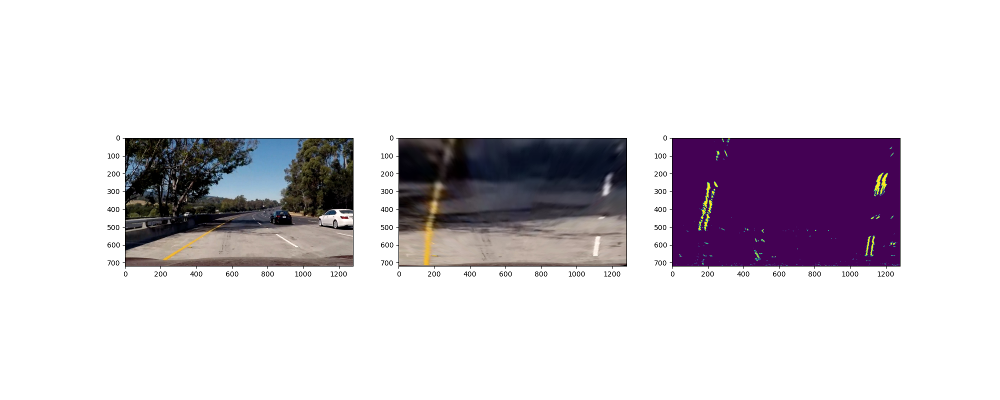

## Advanced Lane Finding

In this project, the goal is to write a software pipeline to identify the lane boundaries in a video.

The Project
---

The goals / steps of this project are the following:

* Compute the camera calibration matrix and distortion coefficients given a set of chessboard images.
* Apply a distortion correction to raw images.
* Use color transforms, gradients, etc., to create a thresholded binary image.
* Apply a perspective transform to rectify binary image ("birds-eye view").
* Detect lane pixels and fit to find the lane boundary.
* Determine the curvature of the lane and vehicle position with respect to center.
* Warp the detected lane boundaries back onto the original image.
* Output visual display of the lane boundaries and numerical estimation of lane curvature and vehicle position.

**The Pipeline**
---

Removal of camera lens distortion:

Verification of perspective transform matrix:

Converting image to top-view perspective and thresholding using a combination of Sobel gradients and saturation

Curve fitting to obtain lanes and the lane region

Annotation with radius of curvature of lanes and the distance of vehicle from center of lanes:

**Result**
---

 "Lane Tracking")

**Execution**
---

run tracklanes.ipynb on jupyter notebook
